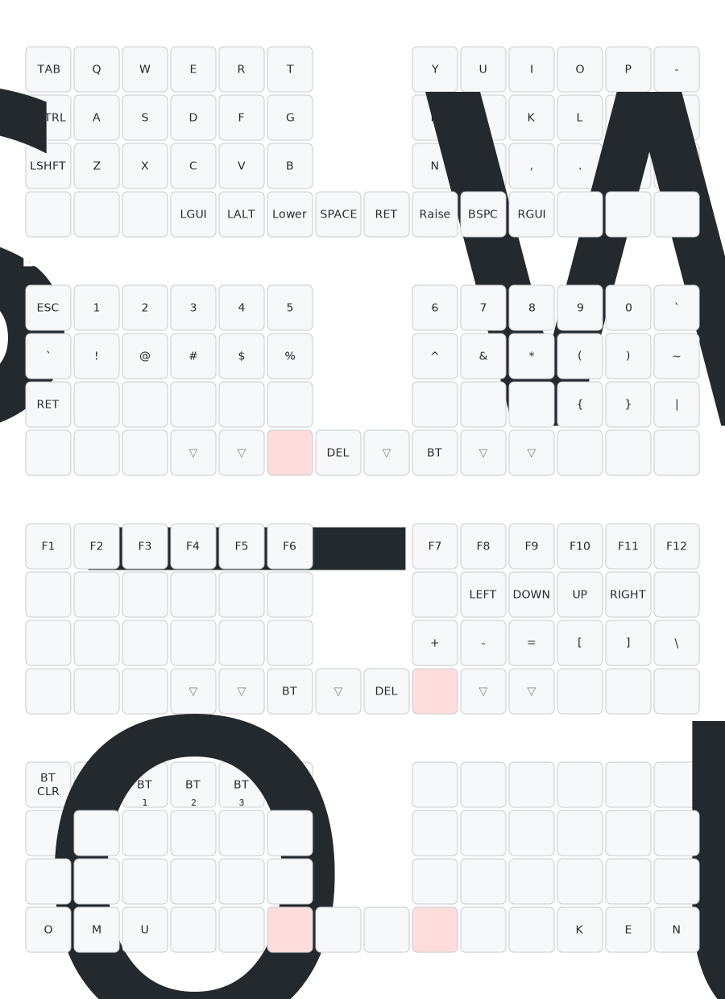

# Poached Eggs

自作の左右分割キーボード **Poached Eggs** 用の [ZMK](https://zmk.dev/) ファームウェア（シールドモジュール）です。

このリポジトリは ZMK の **外部モジュール** 兼 **ユーザー設定 (user config)** として構成されており、GitHub Actions で左右それぞれのファームウェア（`.uf2`）をビルドできます。

---

## 特徴

- **ZMK ファームウェア**（`v0.3.0` に固定）
- **左右分割**構成（左=セントラル / 右=ペリフェラル、Bluetooth 接続）
- **ZMK Studio 対応** — PC やブラウザからキーマップをリアルタイム編集可能（ロック機能付き）
- **4 レイヤー** — QWERTY / 数字・記号 / ファンクション・矢印 / Bluetooth 設定

## ビルド方法

### GitHub Actions（推奨）

1. このリポジトリに push する（または GitHub の **Actions** タブから手動実行）。
2. ワークフローが完了したら、実行結果ページ下部の **Artifacts** から `firmware` をダウンロード。
3. ZIP の中に `poached_eggs_left.uf2` と `poached_eggs_right.uf2` が含まれます。

### ローカルでビルドする場合

ZMK の[ローカルビルド環境](https://zmk.dev/docs/development/local-toolchain/setup)を用意した上で、別の west ワークスペースにこのリポジトリをモジュールとして取り込みます。詳細は ZMK 公式ドキュメントを参照してください。

## 書き込み（フラッシュ）方法

XIAO BLE への書き込みは UF2 ブートローダ経由で行います。

1. キーボードを USB で PC に接続する。
2. **リセットボタンを素早く 2 回押す**（ダブルタップ）。
3. `XIAO-SENSE` などの名前で USB ドライブとしてマウントされる。
4. 対応する `.uf2` ファイル（左手なら `poached_eggs_left.uf2`）をドライブにコピーする。
5. 自動的に再起動して書き込み完了。左右それぞれで実施する。

> 初回は左右ともに書き込み、その後ペアリングしてください。

## キーマップ

`config/poached_eggs.keymap` で定義しています。レイヤーは 5 つです。

| #   | レイヤー | アクセス方法                                         | 用途                                     |
| --- | -------- | ---------------------------------------------------- | ---------------------------------------- |
| 0   | default  | （ベース）                                           | QWERTY 配列                              |
| 1   | lower    | 左親指 `&mo 1` を長押し                              | 数字・記号                               |
| 2   | raise    | 右親指 `&mo 2` を長押し                              | ファンクション・矢印・括弧               |
| 3   | bt       | lower + raise を同時に長押し（各レイヤーの `&mo 3`） | Bluetooth 選択/クリア・Studio ロック解除 |
| 4   | num      | default 右下角の `&tog 4` でトグル                   | テンキー（右手）                         |

### キーマップ図（自動生成）

下図は [keymap-drawer](https://github.com/caksoylar/keymap-drawer) により GitHub Actions（[draw-keymap.yml](.github/workflows/draw-keymap.yml)）で自動生成されます。`config/poached_eggs.keymap` を変更して push すると更新されます。未割り当て(none)は ∅（グレー）、透過(trans)は ▽（青）で色分けしています。

bt レイヤーの主なキー:

- `BT_CLR` … 現在のプロファイルのペアリング情報を消去
- `BT0`〜`BT4` … Bluetooth プロファイルの切り替え
- `STUDIO` … `&studio_unlock`（ZMK Studio の編集ロック解除）

## ZMK Studio での編集

このキーボードは ZMK Studio に対応しています。USB 接続した状態で [ZMK Studio](https://zmk.studio/) を開き、bt レイヤーの `&studio_unlock` でロックを解除すると、キーマップをその場で編集・反映できます。
